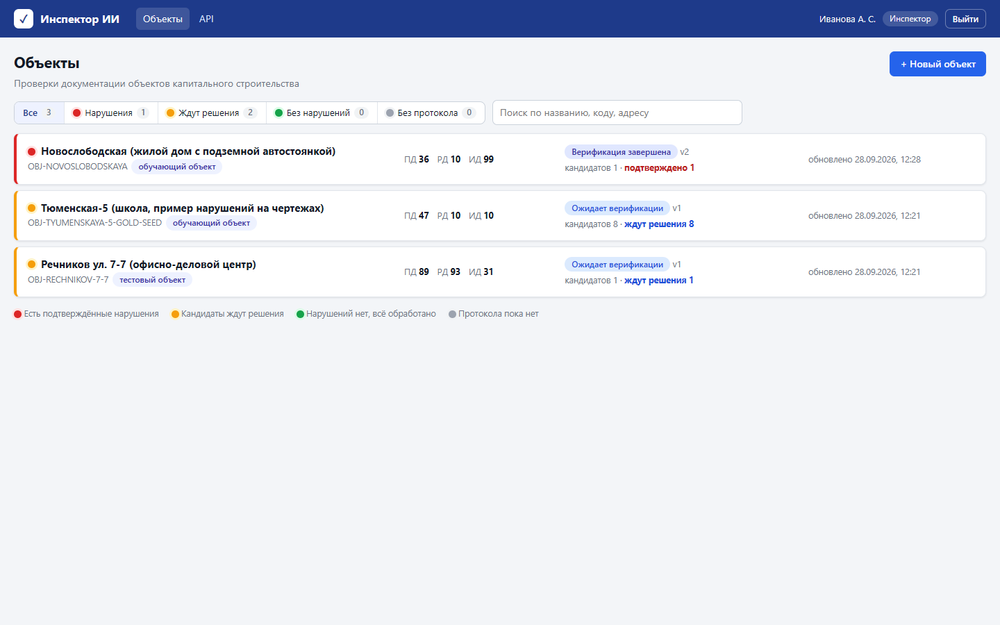
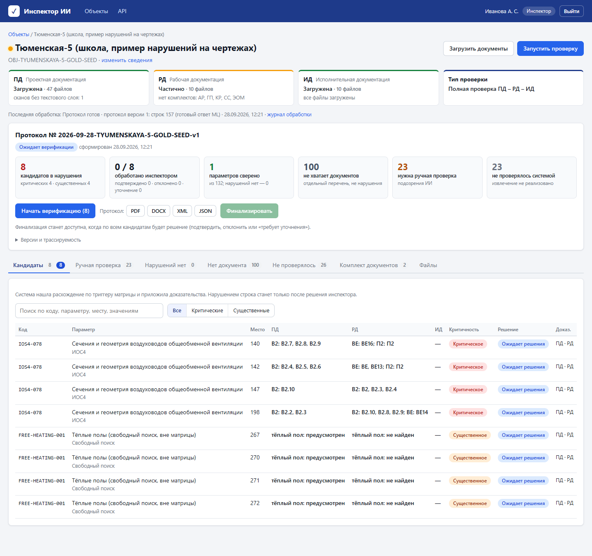
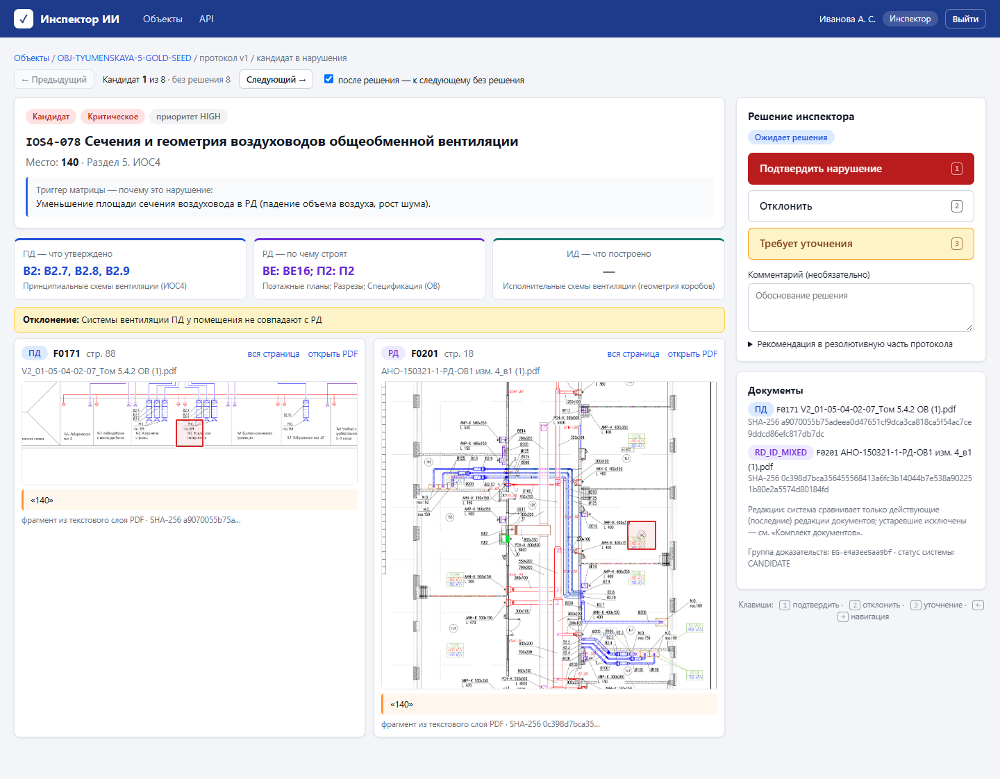
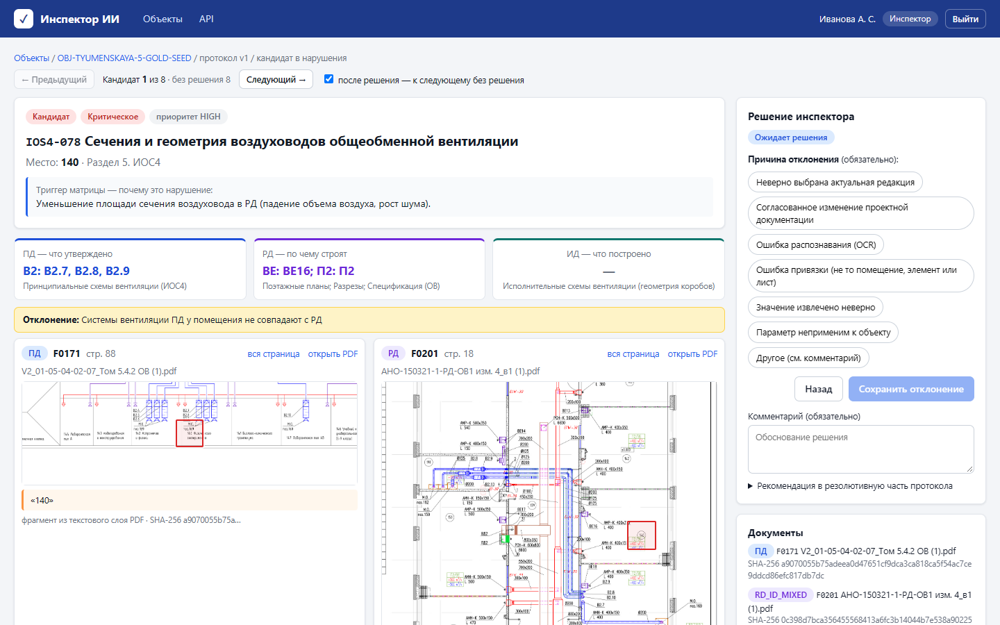
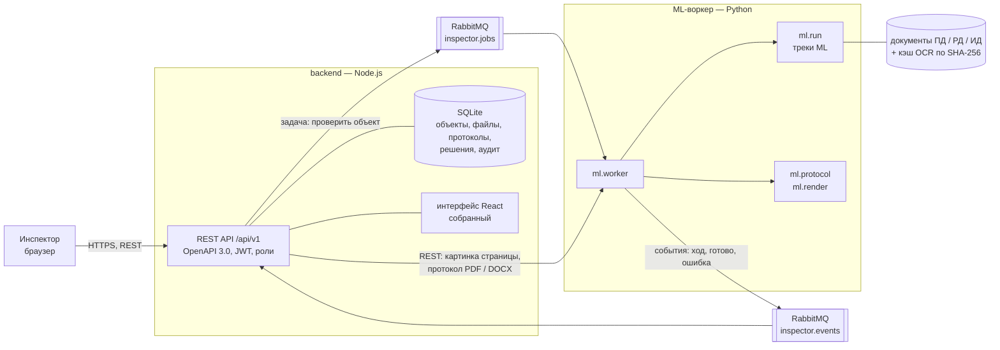
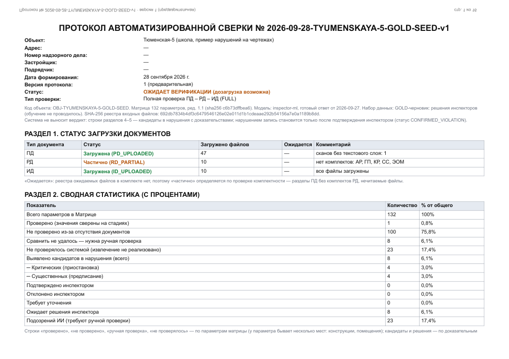
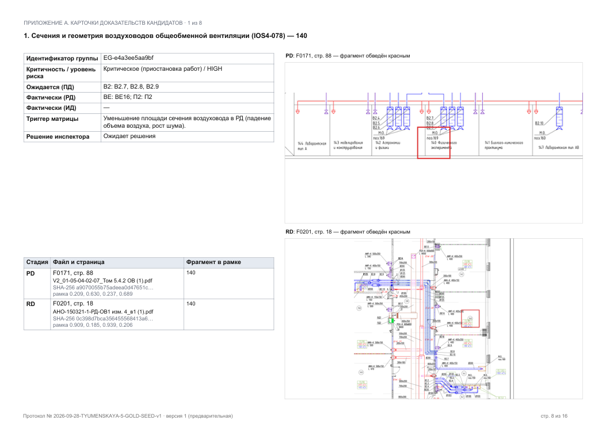

# Инспектор ИИ — сервис: архитектура, API, безопасность, соответствие ТЗ

Документ для жюри и команды: из чего состоит сервис вокруг ML-части, как он устроен, как его развернуть и какие
требования ТЗ (ред. 1.1) чем закрыты. Про сами правила сравнения, данные и метрики ML — документы
[для разработчиков](Инспектор_ИИ_ML_для_разработчиков.md) и [для презентации](Инспектор_ИИ_ML_для_презентации.md).
Как работать в интерфейсе — [руководство пользователя](Инспектор_ИИ_руководство_пользователя.md).

**Главный принцип (ТЗ 9.2):** система не выносит вердикт. Она готовит **кандидатов в нарушения** с карточкой
доказательств — файл, страница, подсвеченный фрагмент, значения ПД / РД / ИД. Нарушением запись становится только
после решения инспектора (`CONFIRMED_VIOLATION`).

## Содержание

1. [Что умеет сервис](#1-что-умеет-сервис)
2. [Архитектура и стек](#2-архитектура-и-стек)
3. [Сценарий инспектора](#3-сценарий-инспектора)
4. [Протокол по Приложению 2](#4-протокол-по-приложению-2)
5. [REST API](#5-rest-api)
6. [Статусы](#6-статусы)
7. [База данных](#7-база-данных)
8. [Безопасность, аудит, логи, мониторинг](#8-безопасность-аудит-логи-мониторинг)
9. [Развёртывание и настройки](#9-развёртывание-и-настройки)
10. [Замеры](#10-замеры)
11. [Соответствие требованиям ТЗ](#11-соответствие-требованиям-тз)
12. [Что проверено и чего нет](#12-что-проверено-и-чего-нет)

## 1. Что умеет сервис

- **Объекты и документы.** Дашборд объектов с цветовой индикацией (красный — есть подтверждённые нарушения, жёлтый —
  кандидаты ждут решения, зелёный — всё обработано, серый — протокола нет). Создание объекта, загрузка и дозагрузка
  файлов ПД / РД / ИД с выбором стадии; проверка формата, размера, целостности PDF и дублей (SHA-256).
- **Асинхронная проверка.** Загрузка возвращает `process_id`; проверка идёт в фоне (Python-воркер запускает ML-пайплайн
  `ml.run`), статус и ход — по `GET /processes/{id}`, результат — по `GET /processes/{id}/result` (pull-модель, ТЗ 1.4).
- **Протокол с версиями.** Каждая проверка — новая версия протокола. При дозагрузке решения инспектора переносятся
  в новую версию, если у строки не изменились метка и значения ПД / РД (ТЗ 9.3: дозагрузка «без сброса верификации»);
  если изменилось только значение ИД (дозагружены акты), решение переносится с пометкой «данные ИД изменились —
  проверьте»; если изменились ПД или РД — строка снова ждёт решения.
- **Верификация.** Карточка кандидата: параметр и триггер матрицы, значения ПД / РД / ИД рядом, страницы-доказательства
  с подсветкой фрагмента (рамка `bbox_norm` с учётом CropBox и поворота листа), имена файлов и SHA-256. Решения:
  «Подтвердить нарушение» — 1 клик, «Отклонить» — 3 клика (кнопка, причина, сохранить; комментарий подставляется из
  причины), «Требует уточнения» — 1 клик. После решения — сразу следующий кандидат без решения. Клавиши 1 / 2 / 3, ← / →.
- **Финализация.** Только когда у всех кандидатов есть решение; после неё решения и дозагрузка запрещены. Отмена
  финализации — супервизор или администратор, с обязательной причиной в журнале аудита.
- **Протокол по образцу Приложения 2** — PDF и DOCX (7 разделов образца + карточки доказательств с вырезками страниц),
  а также XML и JSON.
- **Передача в ИАИС «РиН»** — `POST /inspection/{process_id}`, только для финализированного протокола; без адреса
  внешней системы пакет сохраняется, статус синхронизации `PENDING_SYNC`.
- **Журнал аудита** — каждое действие: пользователь, время, IP, объект, подробности (у решений — прежний и новый статус).
- **Данные для дообучения** (ТЗ 9.4) — выгрузка решений `CONFIRMED_VIOLATION` / `NEGATIVE_VERIFIED` с доказательствами
  как черновик GOLD-набора (включение в набор — после проверки куратором).

| Объекты | Объект и протокол |
|---|---|
|  |  |

| Карточка кандидата | Отклонение с причиной |
|---|---|
|  |  |

## 2. Архитектура и стек

Стек — по ТЗ 1.5: React, Node.js, Python 3.11+, REST и RabbitMQ.



| Компонент | Где | Что делает |
|---|---|---|
| **frontend** | `frontend/` (React 19, Vite) | интерфейс инспектора; в Docker собирается в статические файлы и раздаётся backend |
| **backend** | `backend/` (Node.js 24, Express 5) | REST API и его контракт `openapi.yaml`, проверка запросов по спецификации, вход и роли, БД, очередь, журнал аудита, JSON-логи, метрики, сборка данных протокола, XML / JSON |
| **очередь** | RabbitMQ | задачи «проверить объект» (`inspector.jobs`) и события воркера (`inspector.events`) |
| **ML-воркер** | `ml-service/ml/worker.py` | берёт задачу, пишет реестр объекта, запускает `python -m ml.run` отдельным процессом, отрисовывает страницы-доказательства, публикует события; по REST отдаёт картинки страниц (`ml/render.py`) и файлы протокола (`ml/protocol.py`) |
| **ML-пайплайн** | `ml-service/ml/` | 8 треков извлечения и сравнения, рамки доказательств, целостность комплекта → `submission.json` (см. документ для разработчиков) |
| **хранилище** | том `/data` | БД SQLite, загруженные файлы, папки процессов (ответ ML, лог), кэш картинок страниц |

Два режима очереди, один и тот же код обработки:
- `AMQP_URL` задан (docker-compose) — задачи идут через RabbitMQ, картинки и протокол — REST-запросом к воркеру
  (`ML_HTTP_URL`);
- `AMQP_URL` пуст (локальный запуск без брокера) — backend сам запускает `python -m ml.worker job <задача.json>` и читает
  события из его вывода; картинки и протокол — отдельным процессом Python.

**Почему SQLite.** Встроен в Node.js (`node:sqlite`), не требует отдельного сервера и нативной сборки, транзакции и
внешние ключи есть. Для 100 одновременных инспекторов (ТЗ 11) — заменить на PostgreSQL: запросы простые, схема в
`backend/src/db.js`.

### Стек

| Слой | Технологии | Зачем |
|---|---|---|
| Интерфейс | React 19, React Router 7, Vite 7; без UI-библиотек | дашборд, карточка кандидата с подсветкой, решения в 1–3 клика; собирается в статические файлы, их раздаёт backend |
| Backend | Node.js 24 (≥ 22.13), Express 5, встроенный `node:sqlite`, express-openapi-validator 5, swagger-ui-dist 5, multer 2, amqplib 0.10; JWT HS256 и scrypt — встроенный `node:crypto` | REST API, проверка запросов по OpenAPI, роли, аудит, очередь; ни одной зависимости с нативной сборкой |
| Очередь | RabbitMQ 3.13 | задачи воркеру и события от него (ТЗ 1.5) |
| ML-воркер | Python 3.12 (≥ 3.11), PyMuPDF 1.28, python-docx 1, NumPy, OpenCV (headless), jsonschema 4, pika 1.3 | `ml.run`: текстовый слой и слои CAD из PDF, извлечение и сравнение, рамки доказательств; картинки страниц; протокол PDF / DOCX |
| OCR (вне прогона) | PaddleOCR 3.7 (PP-OCRv5) — сканы ИД, EasyOCR 1.7 — подписи чертежей ОВ; распознавание на GPU, результат — кэш по SHA-256 файла | в прогоне OCR не запускается: распознанный текст берётся из кэша в образе (см. документ для разработчиков) |
| Контейнеры | Docker, Compose v2; образы `node:24-slim` (backend + интерфейс), `python:3.12-slim` (воркер), `rabbitmq:3.13-management-alpine`; образ ML для стенда жюри — `pytorch/pytorch:2.4.1-cuda12.1-cudnn9-runtime` | запуск одной командой |
| Тесты | `node:test` — 11 интеграционных тестов API; самопроверки ML по эталону организаторов (`ml.eval`) | `cd backend && npm test` |

Лицензии всех компонентов — [Лицензии.md](Лицензии.md) (PyMuPDF — AGPL-3.0, RabbitMQ — MPL-2.0, остальное — разрешительные MIT, BSD, Apache-2.0, ISC).

## 3. Сценарий инспектора

1. **Вход** (логин и пароль). Роли: инспектор, супервизор, администратор, ML-инженер.
2. **Объект.** Выбрать на дашборде или создать: наименование, адрес, номер надзорного дела, застройщик, подрядчик —
   это шапка протокола.
3. **Загрузка.** «Загрузить документы» → стадия (ПД / РД / ИД) → файлы → проверка стартует сама. Система принимает
   PDF, DOCX, XML до 50 МБ на файл и 200 МБ за раз; повреждённые PDF и дубли отклоняет с понятной причиной.
4. **Обработка** — от 20 секунд (несколько файлов) до 2–4 минут (объект пакета целиком); ход виден на странице объекта. Статус загрузки стадий: «загружена /
   частично / отсутствует» — «частично», если в РД нет комплектов разделов, которые есть в ПД, или файлы не читаются.
5. **Протокол.** Сводка: кандидаты (критические / существенные), сколько обработано, сколько параметров сверено,
   каких документов не хватает (отдельный перечень — это не нарушения), что требует ручной проверки, что система
   не проверяла. Вкладки по видам строк, целостность комплекта, файлы, история действий.
6. **Верификация** — «Начать верификацию»: карточки кандидатов по очереди, решение в 1–3 клика.
7. **Финализация** → протокол PDF / DOCX / XML → передача в ИАИС «РиН».
8. **Дозагрузка** до финализации: новая версия протокола, решения сохраняются (при новых данных ИД — с пометкой).

## 4. Протокол по Приложению 2

ТЗ 9.2 делает образец Приложения 2 обязательным. Разделы протокола — как в образце:

| Раздел | Содержание |
|---|---|
| Шапка | номер `<дата>-<объект>-v<версия>`, объект, адрес, номер надзорного дела, застройщик, подрядчик, дата, версия (предварительная / окончательная), статус, тип проверки (сценарий загрузки ТЗ 9.2: FULL, PD_RD_ONLY…), версии матрицы, модели и набора данных, SHA-256 реестра входных файлов |
| 1. Статус загрузки документов | ПД / РД / ИД: статус (`PD_UPLOADED` / `_PARTIAL` / `_MISSING`), число файлов, комментарий |
| 2. Сводная статистика с процентами | параметры: проверено, нет документов, ручная проверка, не проверялось; кандидаты: всего, критические, существенные; решения инспектора; подозрения ИИ |
| 3. Параметры, не проверенные из-за отсутствия документов | код, раздел, параметр, какого документа нет |
| 4. Критические нарушения | раздел, параметр и код, место, ПД / РД / ИД, отклонение, решение инспектора |
| 5. Существенные нарушения | то же |
| 6. Подозрения ИИ | строки «сравнили, но не уверены»: метод, описание, значения, решение, причина отклонения, комментарий ИИ (формулировки ТЗ 9.4) |
| 7. Резолютивная часть | 7.1 и 7.2 — рекомендации по **подтверждённым** нарушениям (шаблон по параметру, инспектор может отредактировать в карточке) |
| Приложение А | карточка доказательств на каждого кандидата (ТЗ 9.2, п. 4): группа, ожидаемое и фактическое, триггер, решение, кто и когда, файлы с SHA-256, страница, рамка, фрагмент и **вырезка страницы с подсветкой** |
| Приложение Б | проверенные отрицательные результаты (`NEGATIVE_VERIFIED`) с доказательствами |
| Приложение В | целостность комплекта документов |

| Первая страница | Карточка доказательств |
|---|---|
|  |  |

Как собирается: backend готовит данные (`backend/src/protocol-data.js`), PDF и DOCX верстает Python
(`ml/protocol.py`: PyMuPDF и python-docx), XML и JSON — backend. Протокол Тюменской (8 кандидатов на листах A0) —
9,7 с, 3,7 МБ; Новослободской — 1,6 с (норматив ТЗ 11 — 30 с).

## 5. REST API

Базовый путь `/api/v1`, JSON, токен в заголовке `Authorization: Bearer <токен>`. Контракт —
[`backend/openapi.yaml`](../../backend/openapi.yaml) (OpenAPI 3.0.3); **каждый запрос проверяется по нему**
(express-openapi-validator: тело, параметры пути и запроса, лишние параметры — ошибка 400). Swagger UI — `/api/docs`.

| Метод и путь | Что делает | Кто |
|---|---|---|
| `POST /auth/login`, `GET /auth/me` | вход, текущий пользователь и права | все |
| `GET /reference`, `GET /params` | справочники (причины отклонения, статусы, лимиты), матрица 132 параметров | все |
| `GET /objects`, `POST /objects`, `GET/PATCH /objects/{id}` | объекты (дашборд с индикатором), создание, сведения | просмотр — все; изменение — инспектор, супервизор, администратор |
| `GET /objects/{id}/files` | реестр файлов объекта | все |
| `POST /documents/upload` | загрузка / дозагрузка (multipart: `object_id`, `stage`, `section`, `start`, `files[]`) → `process_id` | инспектор, супервизор, администратор |
| `POST /objects/{id}/inspections` | запустить проверку → `process_id` | то же |
| `GET /processes/{id}`, `GET /processes/{id}/result` | статус и ход обработки; результат (pull) | все |
| `GET /objects/{id}/protocols`, `GET /protocols/{id}` | версии протокола; протокол: статус, сводка, статус загрузки, целостность, доступные действия | все |
| `GET /protocols/{id}/checks`, `GET …/checks/{checkId}` | строки протокола с фильтрами; карточка доказательств | все |
| `PUT / DELETE …/checks/{checkId}/decision` | решение инспектора / отмена решения | инспектор, супервизор |
| `POST /protocols/{id}/finalize`, `…/unfinalize` | финализация; отмена (с причиной) | финализация — инспектор, супервизор; отмена — супервизор, администратор |
| `GET /protocols/{id}/export?format=pdf\|docx\|xml\|json` | протокол | все |
| `GET /files/{id}/pages/{n}?max=&region=` | картинка видимой страницы или её области (для подсветки) | все |
| `GET /files/{id}/download` | исходный файл | все |
| `POST /inspection/{processId}` | передача в ИАИС «РиН» (только `PROTOCOL_FINALIZED`) | инспектор, супервизор |
| `GET /audit` | журнал аудита | супервизор, администратор, ML-инженер |
| `GET /ml/feedback-dataset` | решения для дообучения (JSONL) | ML-инженер, администратор |
| `GET /health`, `GET /metrics` | состояние; метрики Prometheus | без входа |

Ссылка «API» (Swagger UI) в шапке интерфейса видна администратору и ML-инженеру; сам адрес `/api/docs` открыт.

Ошибки — единый формат `{code, message, details, request_id}`: например, `CANDIDATES_PENDING` (финализация при
кандидатах без решения), `PROTOCOL_FINALIZED` (дозагрузка после финализации), `REASON_REQUIRED`, `VALIDATION_ERROR`.

Пример — от загрузки до протокола:

```bash
T=$(curl -s -X POST localhost:8080/api/v1/auth/login -H 'content-type: application/json' \
      -d '{"login":"inspector","password":"inspector"}' | jq -r .token)
curl -s -X POST localhost:8080/api/v1/objects -H "Authorization: Bearer $T" -H 'content-type: application/json' \
     -d '{"object_id":"OBJ-DEMO","name":"Демо-объект"}'
curl -s -X POST localhost:8080/api/v1/documents/upload -H "Authorization: Bearer $T" \
     -F object_id=OBJ-DEMO -F stage=PD -F files=@КР1.pdf        # → {"process_id": "..."}
curl -s localhost:8080/api/v1/processes/<process_id> -H "Authorization: Bearer $T"   # PENDING → PARSING → READY
curl -s "localhost:8080/api/v1/protocols/<protocol_id>/checks?kind=candidate" -H "Authorization: Bearer $T"
curl -s -X PUT localhost:8080/api/v1/protocols/<protocol_id>/checks/<check_id>/decision -H "Authorization: Bearer $T" \
     -H 'content-type: application/json' -d '{"status":"CONFIRMED_VIOLATION","comment":"подтверждаю"}'
curl -s -X POST localhost:8080/api/v1/protocols/<protocol_id>/finalize -H "Authorization: Bearer $T" -H 'content-type: application/json' -d '{}'
curl -s -o protocol.pdf "localhost:8080/api/v1/protocols/<protocol_id>/export?format=pdf" -H "Authorization: Bearer $T"
```

## 6. Статусы

**Процесс** (ТЗ 9.1): `PENDING` → `PARSING` → `READY` → `VERIFYING` → `COMPLETED` → `FINALIZED`; при сбое после двух
повторов — `FAILED` (ТЗ 9.1: «повторная попытка до 2 раз, при неудаче — уведомление администратора»: запись уровня
ERROR в лог и журнал аудита).

**Строка протокола** (ТЗ 9.2) — из метки ML:

| Метка ML | Статус ТЗ | В интерфейсе |
|---|---|---|
| `VIOLATION_PRESENT` | `CANDIDATE` | «Кандидат в нарушения» — нужно решение |
| `NO_VIOLATION` | `NEGATIVE_VERIFIED` | «Проверено, нарушений нет» |
| `MISSING_DOCUMENT` | `MISSING_EVIDENCE` | «Не хватает документа» — отдельный перечень, не нарушение |
| `COMPARISON_IMPOSSIBLE` с доказательствами | `NOT_COMPARABLE` | «Нужна ручная проверка» (подозрения ИИ в протоколе) |
| `COMPARISON_IMPOSSIBLE` без доказательств и значений | `NOT_COMPARABLE` | «Не проверялось системой» — извлечения для параметра нет |

**Решение инспектора** (ТЗ 9.3): нет решения (`PENDING`), `CONFIRMED_VIOLATION`, `NEGATIVE_VERIFIED` (обязательны
`reason_code` и комментарий), `CLARIFICATION_REQUIRED`. Причины отклонения: неверная актуальная редакция, согласованное
изменение ПД, ошибка OCR, ошибка привязки, значение извлечено неверно, параметр неприменим, другое.

**Протокол** (ТЗ 9.3): `READY` (решений нет) → `VERIFYING` → `VERIFICATION_COMPLETED` (у всех кандидатов есть решение) →
`PROTOCOL_FINALIZED`. Уровень риска строки (`HIGH` / `MEDIUM` / `LOW`) — только очерёдность проверки.

## 7. База данных

SQLite, схема — `backend/src/db.js`. Соответствие таблицам ТЗ 10:

| Таблица ТЗ | У нас | Ключевые поля |
|---|---|---|
| Params | `params` | код, раздел, название, источники ПД / РД / ИД, триггер, критичность |
| Objects | `objects` | название, адрес, застройщик, подрядчик, номер надзорного дела |
| Files | `files` | стадия, раздел, путь, SHA-256, кто и когда загрузил, исходная строка реестра |
| Protocols | `protocols` | версия, статус, сценарий, версии матрицы / модели / набора, хэш реестра входных файлов, снимок файлов, отчёт целостности, финализация, синхронизация |
| Checks | `checks` | группа доказательств, параметр, место, метка ML, статус ТЗ, критичность, приоритет, значения, пояснение |
| Evidence_Fragments | `evidence_fragments` | стадия, файл, страница, рамка, источник рамки, фрагмент |
| Audit_Log | `audit_log` | пользователь, действие, объект, подробности, время, IP, User-Agent, request_id |
| Rejection_Log / Dataset_Items | `decisions` + `GET /ml/feedback-dataset` | решение, причина, комментарий, эксперт, время |
| — | `processes` | `process_id`, статус, ход, попытки, лог обработки |

Не реализованы (низкий приоритет ТЗ или вне прототипа): Dispute_Log, Suspicions (свободный поиск — строки ML с кодом
вне матрицы), Logical_Rules, Normative_Base, ML_Retraining_Log, Monitoring_Metrics (метрики — в Prometheus),
Model_Versions (версия модели пишется в протокол).

## 8. Безопасность, аудит, логи, мониторинг

| Требование ТЗ 12–13 | Как сделано |
|---|---|
| Вход по логину и паролю | пароли — scrypt с солью; токен JWT HS256 (срок 12 ч); секрет — `JWT_SECRET` или случайный при первом запуске; не больше 10 неудачных входов с адреса за 5 минут |
| Роли | инспектор (просмотр и верификация), супервизор (+ отмена финализации), администратор (управление, журнал), ML-инженер (просмотр, журнал обработки, данные для дообучения); права проверяются на каждом методе API |
| Журнал аудита | вход, неудачный вход, создание и изменение объекта, загрузка и отклонение файлов, запуск и завершение проверки, каждое решение (прежний и новый статус, причина, комментарий), финализация и её отмена (с причиной), выгрузка протокола, скачивание файла, передача в «РиН», выгрузка данных для дообучения; с временем, IP, User-Agent, request_id |
| Шифрование при передаче | HTTPS с TLS 1.3, если заданы `TLS_CERT` и `TLS_KEY`; в эксплуатации TLS обычно завершает прокси |
| Шифрование в покое, резервное копирование, IDS, антивирус, УКЭП | вне прототипа: делаются средствами инфраструктуры (шифрованный том, резервные копии тома `/data`, антивирус перед сохранением файла) |
| Проверка загружаемых файлов | расширение (PDF, DOCX, XML), размер (50 МБ / 200 МБ), содержимое (заголовок и конец PDF, ZIP у DOCX), дубли по SHA-256 |
| Заголовки | `X-Content-Type-Options`, `X-Frame-Options`, `Referrer-Policy`; `X-Request-Id` на каждом ответе |
| Логи | JSON в stdout, поля `timestamp, level, service, message, request_id, user_id` (+ статус и длительность запроса); уровни DEBUG / INFO / WARNING / ERROR, DEBUG — только при `LOG_LEVEL=DEBUG`; воркер пишет в том же формате |
| Мониторинг | `GET /api/v1/metrics` (Prometheus): запросы, ошибки 5xx, 50-й и 95-й процентили времени ответа, проверки (запущено / готово / с ошибкой), решения, входы, активные сессии, глубина очереди, память и CPU, свободное место на диске данных; `GET /api/v1/health` — для healthcheck контейнеров |

## 9. Развёртывание и настройки

**Docker (одной командой).** Нужны Docker Engine 24+ с Compose v2, 4 ГБ памяти, ~3 ГБ диска (образы — 1,3 ГБ); GPU не нужен.

```bash
git clone https://github.com/midudar/ctrl_z_hackathon.git && cd ctrl_z_hackathon
cp .env.example .env           # порты, пароли, пути к пакету организаторов
docker compose up --build      # → http://localhost:8080, вход inspector / inspector
```

| Сервис | Образ | Что делает |
|---|---|---|
| `rabbitmq` | `rabbitmq:3.13-management-alpine` | очереди `inspector.jobs`, `inspector.events`; панель — http://localhost:15672 |
| `ml-worker` | `ml-service/Dockerfile.worker` (`python:3.12-slim`, без CUDA и torch) | задачи из очереди → `ml.run`; REST для картинок страниц и протокола; healthcheck `GET /health` |
| `backend` | `backend/Dockerfile` (`node:24-slim`, двухэтапная сборка вместе с интерфейсом) | API, интерфейс, база; healthcheck `GET /api/v1/health` |

Данные — том `service-data` (`/data` в обоих контейнерах: база, загруженные файлы, папки процессов, кэш картинок).
Документы пакета организаторов монтируются только для чтения (`PACKAGE_DOCS` → `/input/docs`, `PACKAGE_DATA` →
`/input/data`), готовые ответы ML для первой версии протокола — `ml-service/out` → `/seed`. Пути внутри контейнеров у
воркера и backend одинаковые: в задаче передаются абсолютные пути к файлам.

До сборки желательно распаковать в `ml-service/` архив `inspector_ml_assets.zip` из GitHub Releases: кэш распознанных
страниц `out/cache/` (сканы ИД, распознанные на GPU) попадёт в образ воркера. Без архива образ тоже собирается, но
значения со сканов не извлекаются; сколько файлов кэша нашлось, воркер пишет при старте и в `GET /health`.

Полезные команды: `docker compose logs -f backend ml-worker` — журналы (JSON); `docker compose down` — остановить;
`docker compose down -v` — остановить и удалить данные (при следующем запуске объекты пакета и протоколы v1 создадутся
заново). На Windows без Docker Desktop — Docker Engine в WSL2, скрипт `ml-service/tools/wsl_docker.sh`. Если Docker Hub
из сети недоступен (сборка зависает на `load metadata for docker.io/...`), — зеркало `{"registry-mirrors":
["https://mirror.gcr.io"]}` в `/etc/docker/daemon.json` (скрипт для WSL включает его сам).

**Образ ML для стенда жюри** (`ml-service/Dockerfile`, CUDA runtime + torch, точка входа `python -m ml.run`) — отдельно
от сервиса: объект целиком → `submission.json` в формате организаторов (см. README ML-части).

**Без Docker:** Node.js ≥ 22.13 (проверено на 24), Python 3.11+ (проверено на 3.12):
```bash
cd ml-service && pip install -r requirements-worker.txt           # ML и протокол
cd frontend && npm ci && npm run build                             # интерфейс → frontend/dist
cd backend && npm ci && PYTHON=python3 ML_ROOT=../ml-service npm start   # → http://localhost:8080
```
Очередь в этом режиме — внутри backend (RabbitMQ не нужен), воркер запускается процессом Python.

Настройки backend (переменные окружения):

| Переменная | По умолчанию | Смысл |
|---|---|---|
| `PORT` | 8080 | порт |
| `DATA_DIR` | `../data` | БД, загрузки, процессы, кэш картинок |
| `ML_ROOT` | ищется: `../../`, `../ml-service` | папка с `ml/run.py` |
| `PYTHON` | `python3` (`python` на Windows) | интерпретатор для локального режима |
| `AMQP_URL` | — | RabbitMQ; пусто — локальная очередь |
| `ML_HTTP_URL` | — | REST воркера; пусто — процесс Python |
| `PACKAGE_DOCS`, `PACKAGE_DATA` | папки пакета организаторов, если есть | документы и реестр объектов пакета |
| `SEED_RESULTS`, `SEED` | `ml-service/out`, `1` | импорт готовых ответов ML как протокола v1 при первом запуске |
| `ML_CACHE_DIR` | `ml-service/out/cache` | кэш распознанных страниц для воркера |
| `JWT_SECRET`, `TOKEN_TTL_HOURS` | случайный, 12 | подпись токенов |
| `PASS_INSPECTOR`, `PASS_SUPERVISOR`, `PASS_ADMIN`, `PASS_ML` | = логин | пароли учётных записей стенда (только при первом запуске) |
| `MAX_FILE_MB`, `MAX_BATCH_MB` | 50, 200 | лимиты загрузки |
| `JOB_TIMEOUT_MIN`, `JOB_RETRIES` | 30, 2 | таймаут и повторы обработки |
| `TLS_CERT`, `TLS_KEY` | — | HTTPS |
| `LOG_LEVEL` | INFO | DEBUG для тестового контура |

**Объекты пакета участника** (Новослободская, Тюменская-5, Речников). При первом запуске backend регистрирует объекты
из реестра файлов пакета (`document_manifest.jsonl`: стадия, раздел, SHA-256) и импортирует **наши** готовые ответы ML
(`ml-service/out/submission_*.json`, `integrity_*.json`) как протокол v1 — результат виден сразу. Эталонная разметка
организаторов сервисом не читается. «Запустить проверку» пересчитывает объект заново.

**Новый объект.** Backend сохраняет файлы, считает SHA-256, определяет раздел по шифру в имени файла и пишет реестр
объекта в формате ML (`document_manifest.jsonl` + матрица + схема ответа). Для загруженных файлов нет готового кэша
OCR: значения со сканов не извлекаются (всё, что есть в текстовом слое PDF, — извлекается).

## 10. Замеры

Ноутбук без GPU, локальный режим.

| Что | Время | Норматив ТЗ 11 |
|---|---|---|
| Проверка объекта (`ml.run` + картинки страниц-доказательств) | Новослободская 127 с (145 файлов); Речников через сервис не замерялся, сам `ml.run` — ~4 мин (213 файлов) | сравнение 132 параметров — 2 мин (при распознанных документах) |
| Новый объект из 4 файлов (ПД КР, РД СВГ и КЖ, акт ИД) | 17 с; найден кандидат KR-057 «Форшахта» с доказательствами на всех трёх стадиях; дозагрузка ещё одного файла РД — 19 с, решение перенесено | — |
| Протокол PDF | 1,6 с (Новослободская), 9,7 с (Тюменская, 8 карточек с вырезками листов A0) | 30 с |
| Протокол DOCX | 0,7–9 с | 30 с |
| Картинка страницы | 0,1–2,4 с первый раз (лист A0 — дольше), дальше из кэша | — |
| Ответ API на запросы к БД | десятки миллисекунд | 200 мс (95-й процентиль) |
| Верификация 8 кандидатов Тюменской в браузере (автоматический сценарий: 6 подтверждений, 1 отклонение, 1 уточнение) | 13 с, кликов на решение: 1 / 3 / 1 | 30 мин на протокол, ≤ 3 кликов на нарушение |

В Docker (docker-compose, RabbitMQ, WSL2 на том же ноутбуке, 7 ГБ памяти для WSL):

| Что | Время |
|---|---|
| Первая сборка образов из чистого клона (`docker compose build`) | 6,5 мин, почти всё — скачивание зависимостей по медленному каналу; повторная сборка после правки кода — секунды |
| Демо-объект через очередь: ПД + РД (11 файлов) → протокол v1; дозагрузка ИД (2 акта) → v2 | 21 с и 18 с, как в локальном режиме |
| Пересчёт Новослободской (145 файлов) через очередь | 6,4 мин, результат совпал с v1 строка в строку. Медленнее локальных 2 мин из-за чтения документов с диска Windows через `/mnt/d`: один шаг целостности, читающий все файлы, — ~2 мин; на Linux-хосте с документами на своём диске этого замедления нет |
| Протокол PDF / DOCX Тюменской через REST воркера | 8,3 с / 6,3 с |
| Картинка страницы A0 через REST воркера | 0,5 с |
| Верификация 8 кандидатов в браузере и финализация | 13 с, как в локальном режиме |

## 11. Соответствие требованиям ТЗ

| Требование | Статус | Где |
|---|---|---|
| 1.3 REST, JSON, валидация по OpenAPI 3.0 | сделано | `backend/openapi.yaml`, express-openapi-validator |
| 1.4 асинхронная pull-модель, `process_id`, эндпоинт статуса | сделано | `POST /documents/upload`, `GET /processes/{id}`, `…/result` |
| 1.5 React, Node.js, Python 3.11+, REST и RabbitMQ | сделано | `frontend/`, `backend/`, `ml-service/`, docker-compose |
| 9.1 загрузка PDF / DOCX / XML, ошибки загрузки (формат, повреждённый PDF, 50 / 200 МБ, таймаут и 2 повтора) | сделано | `backend/src/files.js`, `queue.js` |
| 9.1 статусы загрузки стадий и процесса | сделано | `domain.js: stageStatus, processStatus` |
| 9.1 дозагрузка до финализации | сделано; проверка пересчитывается целиком (1–4 мин), не инкрементально по параметрам | `POST /documents/upload` |
| 9.2 протокол по Приложению 2, сценарий загрузки, раздельные таблицы, карточки доказательств | сделано | `protocol-data.js`, `ml/protocol.py` |
| 9.2 версии протокола, версии матрицы / модели / набора | сделано | таблица `protocols` |
| 9.3 верификация: подтвердить / отклонить с reason_code и комментарием / уточнить; ≤ 3 кликов | сделано | `Review.jsx`, `PUT …/decision` |
| 9.3 финализация только после обработки всех кандидатов; запрет изменений; отмена — супервизор с причиной | сделано | `…/finalize`, `…/unfinalize` |
| 9.3 MISSING_EVIDENCE — отдельным перечнем | сделано | вкладка «Нет документа», раздел 3 протокола |
| 9.3 юзабилити-тест на 5 инспекторах | не сделано | нужны реальные инспекторы |
| 9.4 дообучение | частично: выгрузка решений как черновика GOLD-набора; самого дообучения нет (обучать не на чем — правила) | `GET /ml/feedback-dataset` |
| 9.5 свободный поиск гипотез | частично: один пример вне матрицы (тёплые полы `FREE-HEATING-001`) и «подозрения ИИ» (сравнили, но не уверены) | ML |
| 9.6 передача в ИАИС «РиН» только после финализации, PENDING_SYNC | сделано без подписи УКЭП и реального адреса | `POST /inspection/{id}` |
| 10 таблицы БД | основные сделаны (см. раздел 7) | `db.js` |
| 11 производительность | см. раздел 10; 100 одновременных пользователей и SLA не проверялись | — |
| 12 вход, роли, аудит, TLS | сделано; шифрование в покое, IDS, антивирус, резервное копирование — средствами инфраструктуры | раздел 8 |
| 13 JSON-логи с обязательными полями, метрики | сделано; Prometheus-формат, Grafana / ELK / алерты не настроены | `log.js`, `metrics.js` |
| Дашборд с цветовой индикацией, фильтры, экспорт PDF / DOCX / XML | сделано | `Objects.jsx`, `ObjectPage.jsx` |

## 12. Что проверено и чего нет

Проверено на ноутбуке (Windows, локальный режим без Docker):
- автотесты backend (`cd backend && npm test`, 11 тестов): вход и права, проверка по OpenAPI, правила решений и
  финализации, отмена финализации, журнал аудита, выгрузка XML / JSON, перенос решений в новую версию;
- сквозные сценарии в браузере (Edge, puppeteer-core): вход → дашборд → объект → верификация всех кандидатов →
  финализация; создание объекта → загрузка ПД / РД / ИД → проверка → кандидат с доказательствами; дозагрузка с
  переносом решения; отклонение дублей и битых файлов;
- REST-режим воркера (`python -m ml.worker serve` + `ML_HTTP_URL`).

Проверено в Docker (28.09; Docker Engine 29.1, Compose 2.40, Ubuntu 24.04 в WSL2; чистый клон ветки, как в README):
- `docker compose up --build`: сборка всех образов, три контейнера проходят healthcheck; воркер находит кэш
  распознанных страниц (970 файлов), backend подключается к RabbitMQ и импортирует три объекта пакета;
- **путь через RabbitMQ** целиком: загрузка через API → задача в `inspector.jobs` → воркер → события в
  `inspector.events` → протокол; демо-объект (ПД + РД → кандидат KR-057 «Форшахта»; дозагрузка ИД → v2, решение
  перенесено с пометкой; отклонение дубля, не-PDF и xlsx); пересчёт Новослободской — протокол совпал с готовым ответом;
- REST воркера из контейнера backend: картинки страниц, вырезки с рамкой, протокол PDF и DOCX; XML и JSON;
- интерфейс в Edge: верификация 8 кандидатов Тюменской и финализация, ошибок в консоли нет;
- чистый клон **без** архива кэша и **без** пакета организаторов (`.env` = `.env.example`): образы собираются, воркер
  пишет «кэш: 0 файлов», дашборд пуст, демо-объект из загруженных файлов даёт тот же результат.

Образ ML для стенда жюри (`ml-service/Dockerfile`, 29.09): сборка из чистого клона — 153 с (база
`pytorch/pytorch:2.4.1-cuda12.1-cudnn9-runtime`, образ 10,1 ГБ); прогон Речникова `docker run` без GPU — ответ совпал с
эталонным построчно (141 строка: метки, значения, страницы-доказательства, рамки). Отчёт целостности в Linux точнее, чем на
Windows (7 временных файлов в архивах РД против 6), — эталон в `ml-service/out/` обновлён по ответу образа.

Найдено и исправлено при проверке: без архива кэша сборка воркера падала (`COPY out/cach[e]` — в контексте сборки
нет и папки `out/`; теперь шаблон на каждой части пути `ou[t]/cach[e]`); из сети разработчика недоступен Docker Hub —
подсказка про зеркало в README, скрипт для WSL включает его сам.

**Не проверено:** сервис на GPU-хосте и под нагрузкой (100 одновременных пользователей, ТЗ 11); HTTPS с настоящим
сертификатом; сборка на Docker Desktop (Windows / macOS) — там тот же Docker Engine, отличий не ожидается.
