# Инспектор ИИ — руководство пользователя

Руководство для инспекторов Мосгосстройнадзора: как загрузить документацию объекта, разобрать найденные расхождения,
принять решения и получить протокол. Установка и устройство сервиса — в README репозитория и документе
[«Сервис: архитектура, API»](ml-service/docs/Инспектор_ИИ_сервис.md).

**Главное правило.** Система не выносит вердикт. Она сверяет проектную (ПД), рабочую (РД) и исполнительную (ИД)
документацию по матрице из 132 параметров и готовит **кандидатов в нарушения**. К каждому кандидату приложены
доказательства: файл, страница, выделенный фрагмент и значения на каждой стадии. Нарушением кандидат становится только
после того, как инспектор его подтвердит.

## Содержание

1. [Порядок работы коротко](#1-порядок-работы-коротко)
2. [Вход и роли](#2-вход-и-роли)
3. [Список объектов](#3-список-объектов)
4. [Новый объект](#4-новый-объект)
5. [Загрузка документов](#5-загрузка-документов)
6. [Обработка](#6-обработка)
7. [Страница объекта и сводка протокола](#7-страница-объекта-и-сводка-протокола)
8. [Вкладки протокола](#8-вкладки-протокола)
9. [Проверка кандидата и решение](#9-проверка-кандидата-и-решение)
10. [Дозагрузка документов и версии протокола](#10-дозагрузка-документов-и-версии-протокола)
11. [Финализация](#11-финализация)
12. [Протокол: выгрузка и передача в ИАИС «РиН»](#12-протокол-выгрузка-и-передача-в-иаис-рин)
13. [Журнал аудита](#13-журнал-аудита)
14. [Справочник статусов](#14-справочник-статусов)
15. [Горячие клавиши](#15-горячие-клавиши)
16. [Если что-то пошло не так](#16-если-что-то-пошло-не-так)

## 1. Порядок работы коротко

1. Создайте объект и загрузите документы ПД, РД и ИД. Проверка запустится сама.
2. Дождитесь протокола. Обычно это от 20 секунд до нескольких минут.
3. Нажмите «Начать верификацию» и по каждому кандидату примите решение: подтвердить, отклонить с причиной или
   отправить на уточнение. Подтверждение — 1 клик, отклонение — 2 (причина → «Отклонить»): с открытием карточки не больше 3 действий.
4. Если пришли новые документы, дозагрузите их. Протокол пересчитается, решения сохранятся.
5. Финализируйте протокол и выгрузите его в PDF, DOCX или XML.

## 2. Вход и роли

Откройте адрес сервиса в браузере (на стенде — http://localhost:8080), введите логин и пароль и нажмите «Войти».
На стенде пароль совпадает с логином. Под формой есть список учётных записей: клик по логину заполняет оба поля.

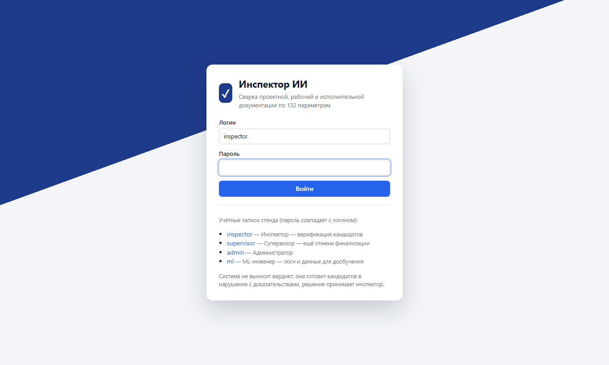

| Роль | Логин на стенде | Что может |
|---|---|---|
| Инспектор | `inspector` | создавать объекты, загружать документы, запускать проверку, принимать решения, финализировать, выгружать протокол |
| Инспектор-супервизор | `supervisor` | то же, что инспектор, плюс отмена финализации, журнал аудита и история действий по объекту |
| Администратор | `admin` | объекты и загрузка, отмена финализации, журнал аудита, пользователи; решений по кандидатам не принимает |
| ML-инженер | `ml` | просмотр, полные журналы обработки, журнал аудита, выгрузка решений для дообучения моделей |

В правом верхнем углу видны имя пользователя, роль и кнопка «Выйти». Сеанс действует 12 часов, потом система попросит
войти снова.

## 3. Список объектов

После входа открывается список объектов. Цветная точка у объекта показывает его состояние:

| Цвет | Значит |
|---|---|
| 🔴 красный | есть подтверждённые нарушения |
| 🟡 жёлтый | кандидаты ждут решения или отправлены на уточнение |
| 🟢 зелёный | нарушений нет, всё обработано |
| ⚪ серый | протокола пока нет |

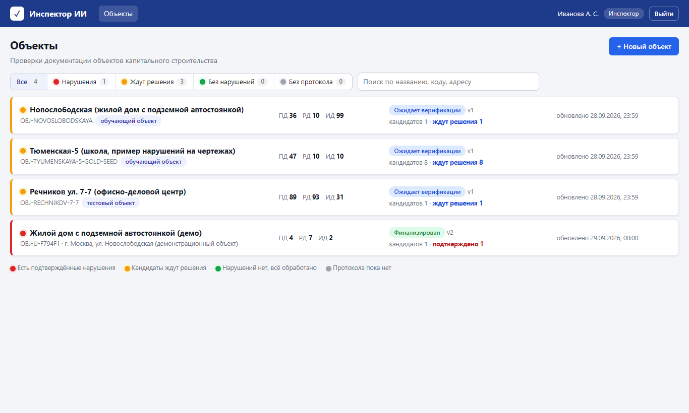

- **Фильтры** над списком: «Все», «Нарушения», «Ждут решения», «Без нарушений», «Без протокола». Число рядом — сколько
  объектов в группе.
- **Поиск** по названию, коду объекта и адресу.
- В строке объекта: сколько файлов загружено по стадиям (ПД, РД, ИД), статус и версия протокола, сколько кандидатов,
  сколько из них ждут решения и сколько подтверждено. Справа — время последней обработки или полоса хода, если
  проверка идёт прямо сейчас.
- Список обновляется сам каждые несколько секунд.

Клик по строке открывает страницу объекта.

## 4. Новый объект

Кнопка «+ Новый объект» справа вверху. Обязательно только наименование. Адрес, номер надзорного дела, застройщик и
подрядчик попадут в шапку протокола, их можно заполнить и позже: ссылка «изменить сведения» на странице объекта.

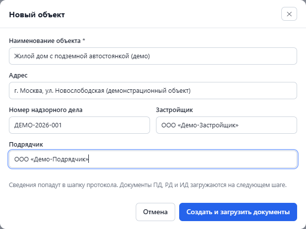

«Создать и загрузить документы» создаёт объект и сразу открывает окно загрузки.

## 5. Загрузка документов

Окно открывается кнопкой «Загрузить документы» на странице объекта.

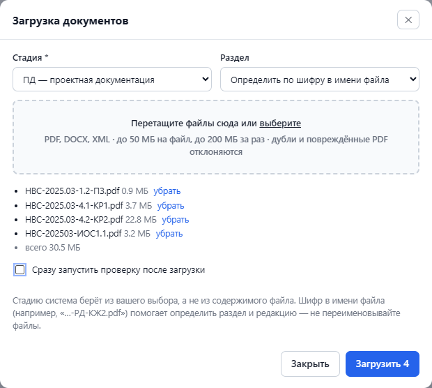

1. **Стадия** — ПД, РД или ИД. Стадию система берёт из вашего выбора, поэтому документы разных стадий загружайте
   отдельно.
2. **Раздел.** Оставьте «Определить по шифру в имени файла»: раздел (КР, АР, ОВ, ЭОМ…) система поймёт по шифру вроде
   «…-РД-КЖ2.pdf». Выбирайте раздел вручную, только если в имени файла шифра нет.
3. **Файлы** — перетащите в поле или нажмите «выберите». Подходят PDF, DOCX и XML, до 50 МБ на файл и до 200 МБ за
   одну загрузку. Файлы можно убрать из списка до отправки.
4. **«Сразу запустить проверку после загрузки».** Если загружаете несколько стадий подряд, снимите галочку для всех,
   кроме последней: проверка запустится один раз, по полному комплекту.

Не переименовывайте файлы. Шифр в имени помогает определить раздел и выбрать действующую редакцию документа.

Система отклонит файл и объяснит почему:

| Причина | Что делать |
|---|---|
| «такой файл уже есть в объекте» — точная копия уже загруженного, даже под другим именем | ничего, файл уже в комплекте |
| «файл не является PDF» или «PDF повреждён или загружен не полностью» | взять файл заново из источника |
| «формат … не поддерживается» | сохранить документ в PDF |
| «Файл превышает 50 МБ» или «Общий объём пакета превышает лимит» | загрузить частями |

Остальные файлы из той же загрузки принимаются. После загрузки появляется сообщение «Принято файлов: N».

## 6. Обработка

Пока идёт проверка, на странице объекта видна полоса хода.

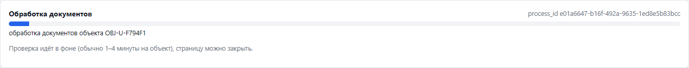

- Несколько файлов проверяются примерно за 20 секунд, объект целиком (сотни файлов) — за 2–4 минуты.
- Страницу можно закрыть, проверка идёт на сервере. Когда она закончится, появится сообщение «Проверка завершена:
  протокол готов».
- После завершения в строке «Последняя обработка» есть ссылка «журнал обработки»: там видно, какие проверки выполнены
  и сколько времени заняли.
- Кнопка «Запустить проверку» пересчитывает объект заново, например после исправления документов.

## 7. Страница объекта и сводка протокола

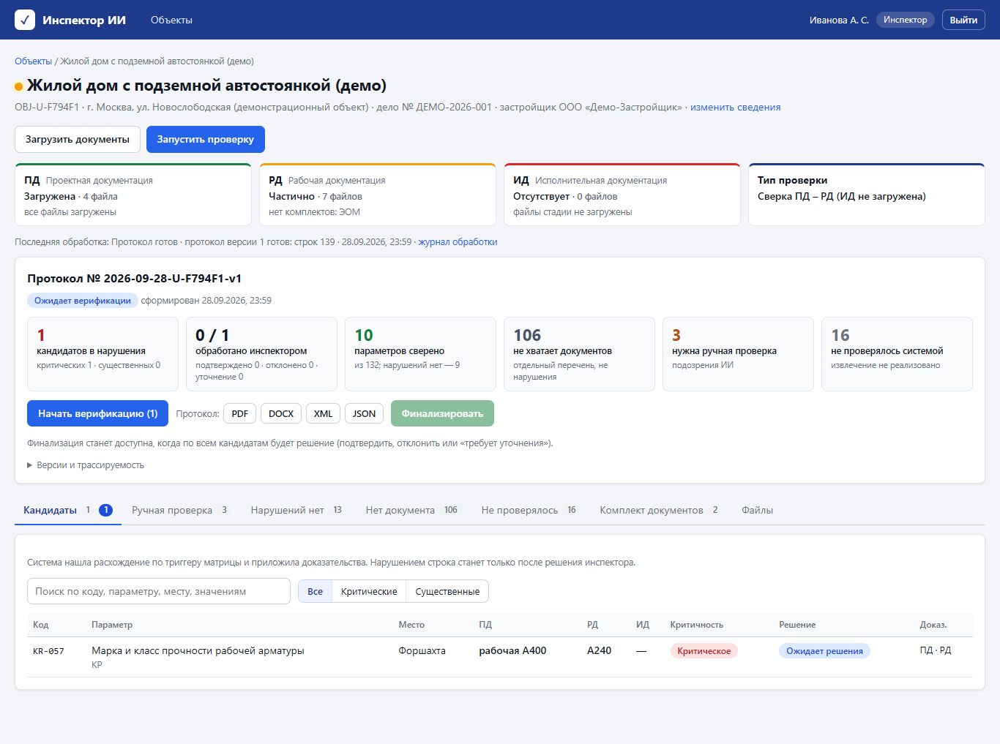

**Карточки стадий** (ПД, РД, ИД) показывают, что загружено:
- «Загружена» — файлы есть, проблем не найдено;
- «Частично» — файлы есть, но комплект неполный. Причина указана ниже, например «нет комплектов: ЭОМ»: в ПД есть
  раздел электроснабжения, а в РД такого комплекта нет;
- «Отсутствует» — файлов стадии нет.

**«Тип проверки»** зависит от загруженных стадий: «Полная проверка ПД – РД – ИД», «Сверка ПД – РД (ИД не загружена)»
и так далее.

**Протокол** — номер (дата, код объекта, версия), статус и шесть плиток:

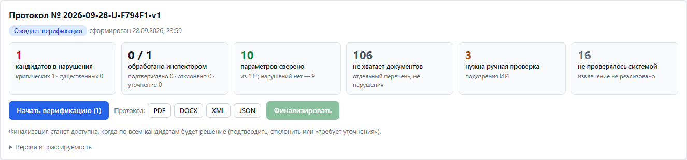

| Плитка | Что считает |
|---|---|
| кандидатов в нарушения | найденные расхождения, по ним нужно решение; ниже — сколько критических и существенных |
| обработано инспектором | сколько кандидатов уже с решением; ниже — подтверждено, отклонено, на уточнении |
| параметров сверено | сколько параметров из 132 удалось сравнить; ниже — у скольких расхождений нет |
| не хватает документов | параметры, которые нельзя проверить без недостающего документа. Это **не нарушения**, а отдельный перечень для дозагрузки |
| нужна ручная проверка | система сравнила, но не уверена в результате |
| не проверялось системой | для этих параметров автоматической проверки пока нет |

Под плитками:
- **«Начать верификацию (N)»** — открывает первого кандидата без решения;
- **«Протокол: PDF, DOCX, XML, JSON»** — выгрузка в любой момент, в том числе до финализации (такая выгрузка
  помечается как предварительная);
- **«Финализировать»** — становится активной, когда у всех кандидатов есть решение;
- **«Версии и трассируемость»** — версия матрицы параметров, модели и набора данных, контрольная сумма комплекта файлов.
  Нужно, чтобы позже можно было точно восстановить, на каких данных построен протокол.

## 8. Вкладки протокола

Под сводкой — строки протокола, разложенные по вкладкам. Число на вкладке — сколько в ней строк.

| Вкладка | Что в ней | Нужно ли решение |
|---|---|---|
| **Кандидаты** | найдено расхождение по триггеру матрицы, приложены доказательства | **да**, по каждой строке |
| **Ручная проверка** | значение нашлось только на одной стадии, документы противоречат друг другу или сработала страховка системы. Это «подозрения ИИ» в протоколе | нет, по желанию |
| **Нарушений нет** | значения на стадиях сверены, расхождения нет; доказательства приложены для выборочной проверки | нет, по желанию |
| **Нет документа** | параметр нельзя проверить: в комплекте нет нужного документа (колонка «Пояснение»: какого) | нет |
| **Не проверялось** | параметры, которые система пока не умеет извлекать | нет |
| **Комплект документов** | дефекты самих файлов: пустые и битые файлы, дубли, сканы без текста, разделы ПД без комплекта РД, устаревшие редакции | нет |
| **Файлы** | все файлы объекта: стадия, раздел, размер, контрольная сумма SHA-256, загружен или из пакета | — |
| **История** | все действия по объекту (видят супервизор, администратор, ML-инженер) | — |

В таблицах есть поиск по коду, параметру, месту и значениям и фильтр «Критические / Существенные». Клик по строке во
вкладках «Кандидаты», «Ручная проверка» и «Нарушений нет» открывает карточку с доказательствами.

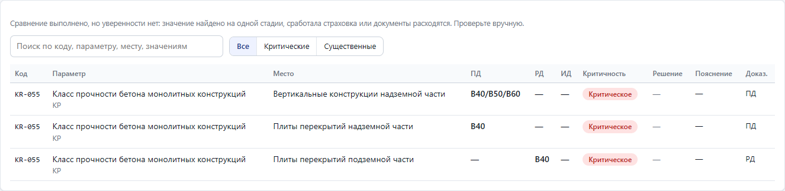

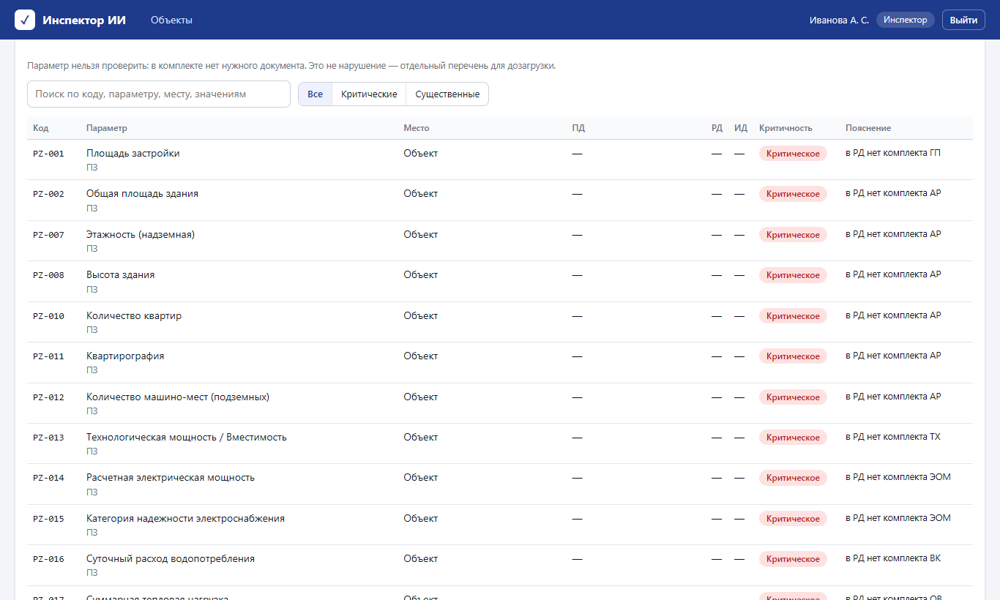

## 9. Проверка кандидата и решение

Карточка кандидата — основной рабочий экран.

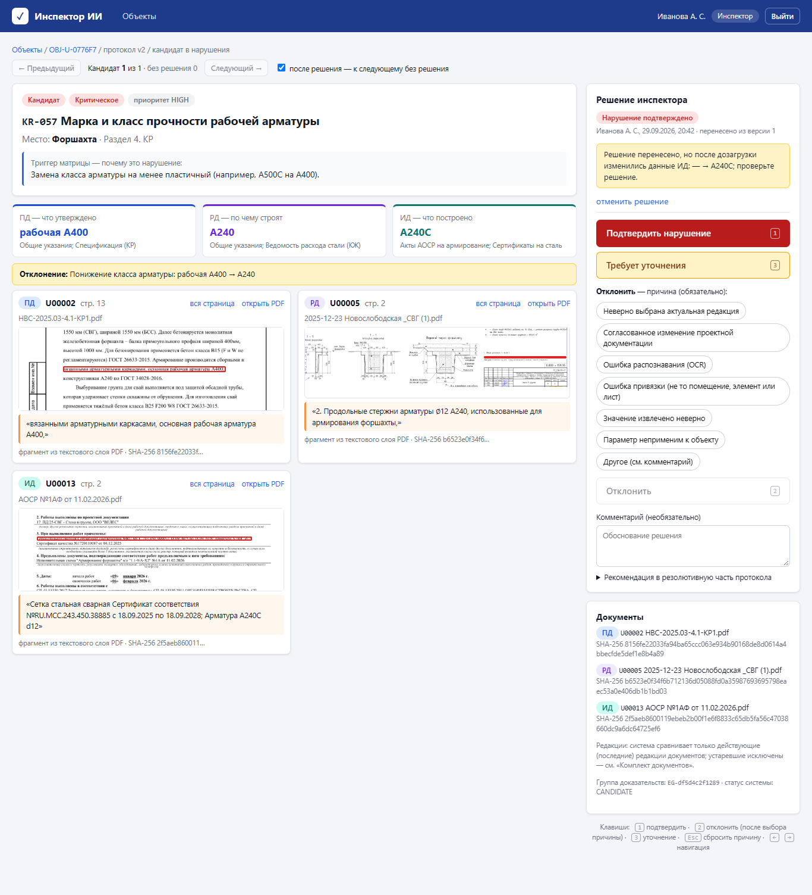

**Слева — что нашла система:**
- код и название параметра, место (помещение, конструкция или объект целиком), раздел;
- **триггер матрицы** — какое изменение матрица считает нарушением;
- **значения по стадиям**: ПД — что утверждено, РД — по чему строят, ИД — что построено. Под значением указан
  документ-источник из матрицы;
- **отклонение** — одной строкой, что именно изменилось;
- **доказательства** — вырезки страниц каждой стадии. Найденный фрагмент обведён красным, ниже он же текстом.
  Подпись показывает, откуда взят фрагмент: из текстового слоя PDF или из распознанного скана (OCR).
  - «вся страница» открывает лист целиком — удобно для чертежей;
  - «открыть PDF» открывает исходный файл на нужной странице.

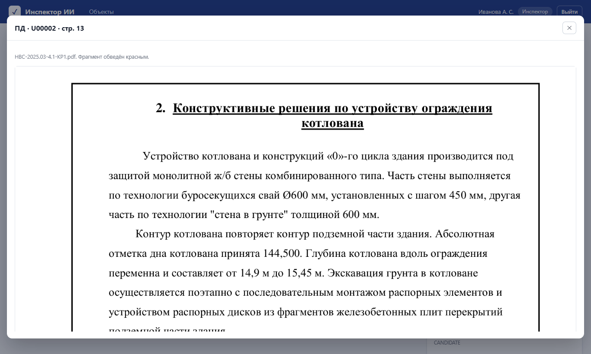

**Справа — решение инспектора:**

| Решение | Как | Кликов |
|---|---|---|
| **Подтвердить нарушение** | кнопка или клавиша `1` | 1 |
| **Отклонить** | причина (список виден сразу) → кнопка «Отклонить» или клавиша `2` | 2 |
| **Требует уточнения** | кнопка или клавиша `3` | 1 |

Вместе с открытием карточки любое решение — не больше 3 действий.

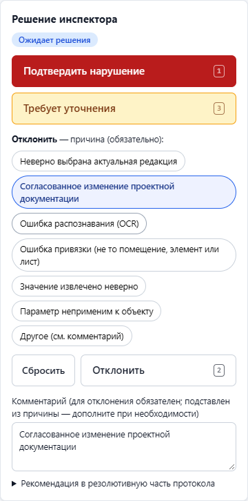

При отклонении нужно указать причину. Комментарий обязателен, но система подставляет его из причины, и его можно
дополнить. Причины:
- неверно выбрана актуальная редакция;
- согласованное изменение проектной документации;
- ошибка распознавания (OCR);
- ошибка привязки (не то помещение, элемент или лист);
- значение извлечено неверно;
- параметр неприменим к объекту;
- другое (см. комментарий).

«Сбросить» или `Esc` снимает выбранную причину без сохранения; подставленный из неё комментарий тоже убирается.

Ещё в правой части:
- **Комментарий** к подтверждению или уточнению — необязательный (подставленный из причины отклонения текст с ними не
  сохраняется).
- **«Рекомендация в резолютивную часть протокола»** — готовый текст рекомендации по параметру. Его можно
  отредактировать, при подтверждении нарушения он попадёт в раздел 7 протокола.
- **«отменить решение»** — вернуть кандидата в «Ожидает решения». Работает до финализации.
- **«Документы»** — все файлы карточки с полной контрольной суммой SHA-256.

**Переходы.** После решения система сама открывает следующего кандидата без решения. Это отключается галочкой
«после решения — к следующему без решения». Кнопки «← Предыдущий» и «Следующий →» или клавиши `←` `→` листают
кандидатов по порядку. Когда решения есть у всех, появится сообщение «Все кандидаты обработаны».

Строки из вкладок «Ручная проверка» и «Нарушений нет» открываются в такой же карточке. Решение по ним можно принять,
но оно необязательно: для финализации нужны решения только по кандидатам.

## 10. Дозагрузка документов и версии протокола

До финализации документы можно дозагружать: «Загрузить документы» → стадия → файлы. Каждая проверка создаёт новую
версию протокола (v1, v2, …). Прежние версии остаются, их можно открыть в списке «Версия», но решения принимаются только
в последней.

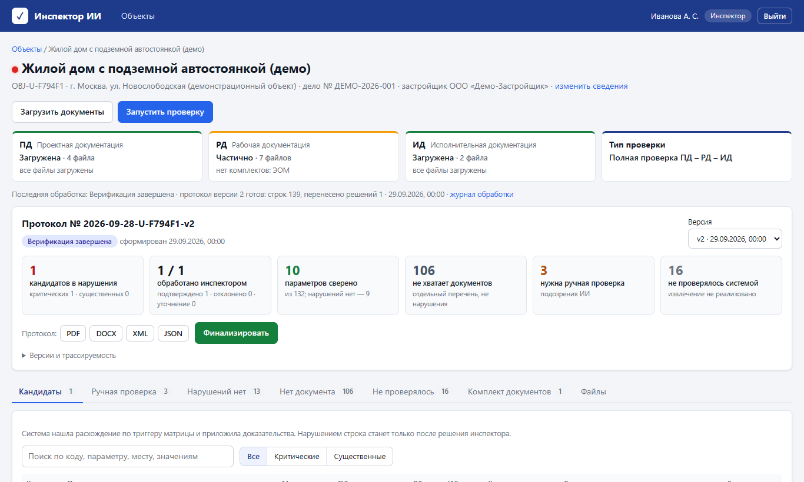

Решения переносятся в новую версию, дозагрузка их не сбрасывает:

| Что изменилось в строке | Что с решением |
|---|---|
| ничего | переносится как есть |
| только значение ИД (например, дозагружены акты) | переносится с пометкой **«данные ИД изменились — проверьте»** |
| значения ПД или РД, или сама строка | не переносится, кандидат снова ждёт решения |

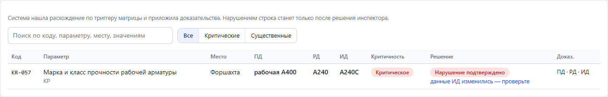

В карточке перенесённого решения указано, из какой версии оно пришло, и что именно изменилось:

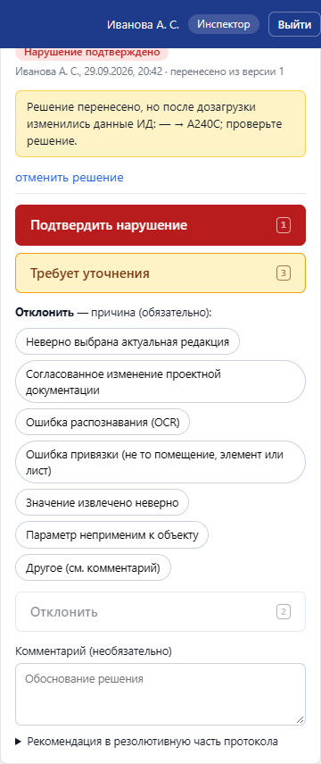

## 11. Финализация

Когда у всех кандидатов есть решение (подтверждено, отклонено или «требует уточнения»), нажмите «Финализировать» и
подтвердите. После финализации:
- протокол получает статус «Финализирован», в нём записаны время и автор;
- решения, дозагрузка и повторная проверка недоступны;
- появляется кнопка «Передать в ИАИС «РиН»».

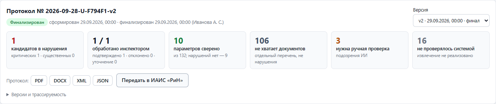

Если после финализации нужно что-то исправить, финализацию отменяет **супервизор или администратор**: кнопка
«Отменить финализацию» на странице объекта. Причина обязательна и попадает в журнал аудита. Протокол вернётся в статус
«Верификация завершена», дозагрузка снова станет доступна.

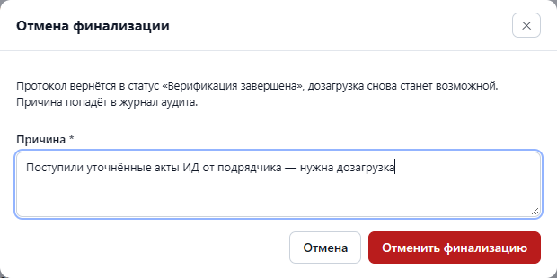

## 12. Протокол: выгрузка и передача в ИАИС «РиН»

Протокол выгружается кнопками PDF, DOCX, XML и JSON на странице объекта. PDF и DOCX оформлены по образцу Приложения 2
к ТЗ:

| Раздел | Содержание |
|---|---|
| Шапка | номер, объект, адрес, номер надзорного дела, застройщик, подрядчик, дата, версия, статус, тип проверки |
| 1. Статус загрузки документов | ПД, РД, ИД: загружено, частично или отсутствует |
| 2. Сводная статистика | параметры и кандидаты с процентами, решения инспектора |
| 3. Параметры, не проверенные из-за отсутствия документов | какого документа не хватает |
| 4–5. Критические и существенные нарушения | значения ПД / РД / ИД, отклонение, решение инспектора |
| 6. Подозрения ИИ | строки «Ручная проверка» с комментарием системы |
| 7. Резолютивная часть | рекомендации по подтверждённым нарушениям |
| Приложения А, Б, В | карточки доказательств с вырезками страниц, проверенные строки без нарушений, дефекты комплекта |

| Первая страница | Карточка доказательств |
|---|---|
|  |  |

**Передача в ИАИС «РиН»** доступна только для финализированного протокола. На стенде адрес внешней системы не
настроен: пакет формируется и сохраняется со статусом «ждёт отправки» (PENDING_SYNC), этот статус виден в шапке
протокола.

## 13. Журнал аудита

Пункт «Журнал аудита» в верхнем меню есть у супервизора, администратора и ML-инженера. В журнале записано каждое
действие: время, пользователь, действие, объект, подробности и IP-адрес. У решений по кандидатам журнал хранит прежний
и новый статус, причину и комментарий. Список «Все действия» фильтрует записи по типу: входы, загрузки, решения,
финализации, выгрузки протокола и так далее.

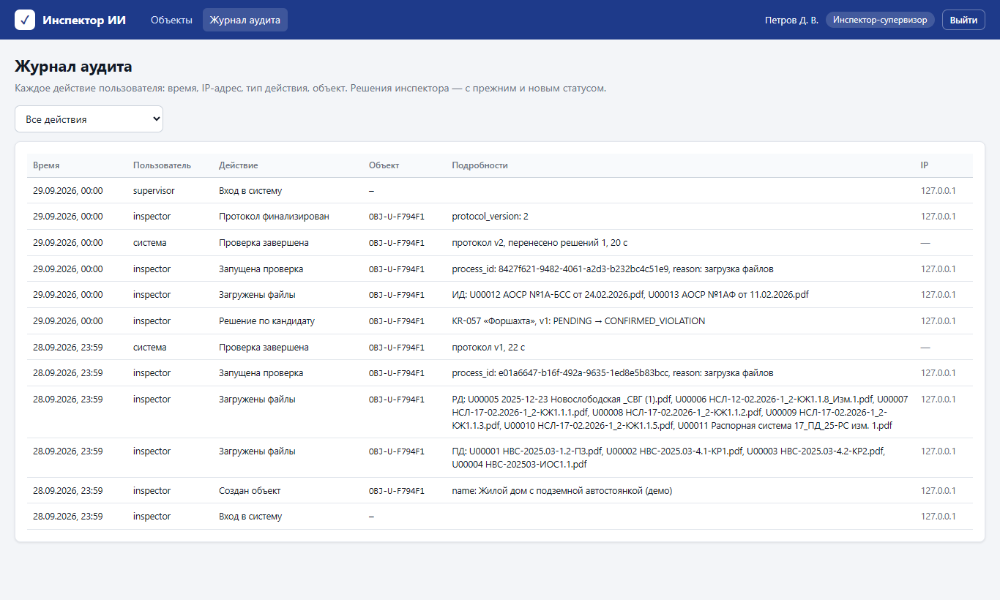

Те же записи по одному объекту — на вкладке «История» страницы объекта. ML-инженеру в журнале доступна кнопка
«Решения для дообучения (JSONL)»: выгрузка подтверждённых и отклонённых кандидатов с доказательствами для улучшения
моделей.

## 14. Справочник статусов

**Решение по кандидату**

| Статус | Значит |
|---|---|
| Ожидает решения | инспектор ещё не смотрел |
| Нарушение подтверждено | инспектор подтвердил нарушение |
| Отклонено | не нарушение, указаны причина и комментарий |
| Требует уточнения | нужны дополнительные сведения; для финализации считается решением, но объект остаётся жёлтым |

**Протокол**

| Статус | Значит |
|---|---|
| Ожидает верификации | решений ещё нет |
| Идёт верификация | часть решений принята |
| Верификация завершена | решения есть у всех кандидатов, можно финализировать |
| Финализирован | протокол закрыт, изменения запрещены |

**Обработка**

| Статус | Значит |
|---|---|
| В очереди | проверка ждёт своей очереди |
| Обработка документов | идёт проверка, видна полоса хода |
| Протокол готов | новая версия протокола создана |
| Ошибка обработки | проверка не удалась после двух повторов, см. «журнал обработки» |

**Критичность** берётся из матрицы параметров: «Критическое» — основание для приостановки работ, «Существенное» —
основание для предписания.

## 15. Горячие клавиши

В карточке кандидата:

| Клавиша | Действие |
|---|---|
| `1` | подтвердить нарушение |
| `2` | отклонить с выбранной причиной (без причины — переводит фокус на список причин) |
| `3` | требует уточнения |
| `←` `→` | предыдущий / следующий кандидат |
| `Esc` | закрыть лист целиком или сбросить выбранную причину |

Клавиши не срабатывают, пока курсор стоит в поле комментария.

## 16. Если что-то пошло не так

| Ситуация | Причина и что делать |
|---|---|
| Кнопка «Финализировать» неактивна | не у всех кандидатов есть решение, об этом написано под кнопками. «Начать верификацию (N)» откроет первого кандидата без решения |
| Кнопки «Загрузить документы» и «Запустить проверку» неактивны | протокол финализирован. Нужна отмена финализации супервизором |
| Файл отклонён при загрузке | причина написана рядом с именем файла, см. [раздел 5](#5-загрузка-документов) |
| «Ошибка обработки» | откройте «журнал обработки» и запустите проверку ещё раз. Если ошибка повторяется, передайте журнал администратору или ML-инженеру |
| В карточке «Страница недоступна» | исходный файл недоступен серверу (например, не подключена папка с документами). Обратитесь к администратору |
| У отсканированных документов пустые значения | в поставке сервис читает текст, который есть в PDF. Сканы объектов пакета распознаны заранее, для новых сканов значения появятся после подключения распознавания (OCR) на сервере. На вкладке «Комплект документов» видно, сколько страниц без текста |
| Много строк «Не проверялось системой» | это параметры, для которых система пока не умеет извлекать значения. Это не «данные несопоставимы» и не нарушения |
| Выбросило на страницу входа | истёк 12-часовой сеанс, войдите снова |
